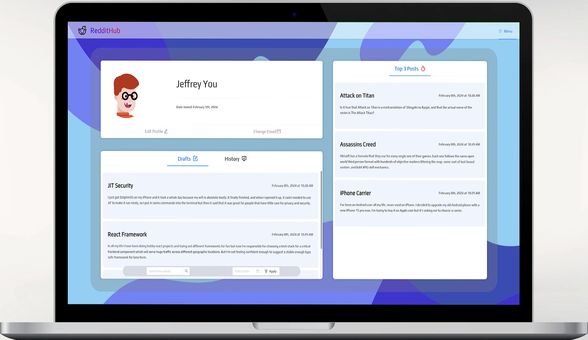
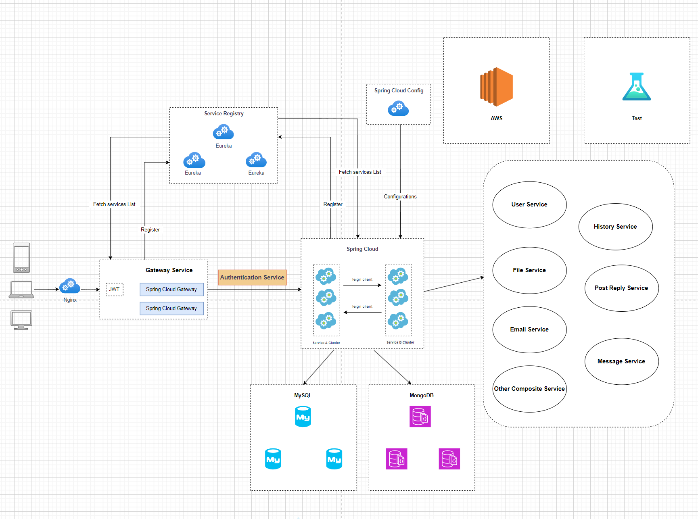
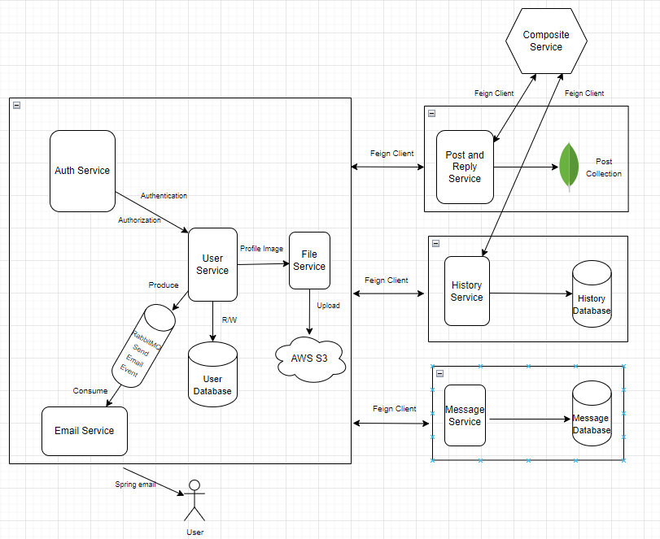

<h2 align="center">
  RedditHub Forum
</h2>

  

## Architecture

### 1. Overview

  

### 2. Microservices

  

## Tech Stack

This project was built using these technologies:

Backend:

- Java
- Spring Boot (MVC, Security, AOP, Task, Data Repository)
- Spring Cloud (Gateway, Eureka, Sleuth)
- Open Feign
- MySQL
- MongoDB
- RabbitMQ
- Docker
- AWS
- Mockito
- Nginx
- Swagger

Frontend:

- React.js
- TypeScript
- Node.js
- Nginx
- Flexbox
- SCSS
- Ant Design
- Zustand
- Framer Motion

